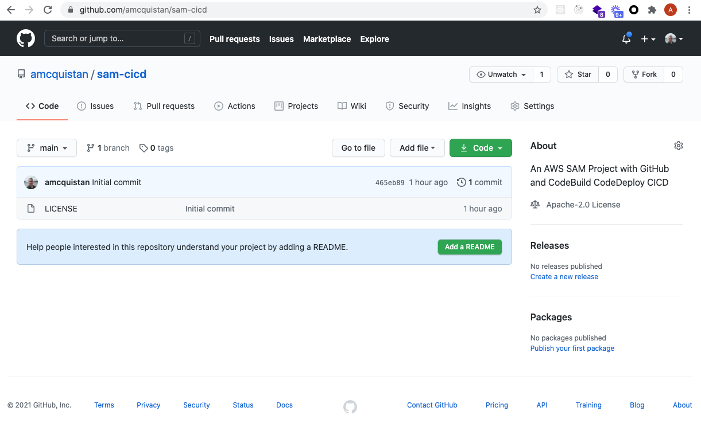

# CI/CD with AWS SAM CodeDeploy and GitHub


### SAM Project Setup

Initialize a new SAM project.

```
$ sam init --name sam-cicd --runtime python3.8
Which template source would you like to use?
        1 - AWS Quick Start Templates
        2 - Custom Template Location
Choice: 1
What package type would you like to use?
        1 - Zip (artifact is a zip uploaded to S3)
        2 - Image (artifact is an image uploaded to an ECR image repository)
Package type: 1

Cloning app templates from https://github.com/aws/aws-sam-cli-app-templates

AWS quick start application templates:
        1 - Hello World Example
        2 - EventBridge Hello World
        3 - EventBridge App from scratch (100+ Event Schemas)
        4 - Step Functions Sample App (Stock Trader)
        5 - Elastic File System Sample App
Template selection: 1

    -----------------------
    Generating application:
    -----------------------
    Name: sam-cicd
    Runtime: python3.8
    Dependency Manager: pip
    Application Template: hello-world
    Output Directory: .
    
    Next steps can be found in the README file at ./sam-cicd/README.md
```


Replace the SAM project's template.yaml with the following.

```
AWSTemplateFormatVersion: '2010-09-09'
Transform: AWS::Serverless-2016-10-31
Description: >
  python3.8

  Sample SAM Template for sam-cicd

Globals:
  Function:
    Timeout: 30

Resources:
  RandomNumberFunction:
    Type: AWS::Serverless::Function
    Properties:
      Events:
        RandomNumberApi:
          Type: Api
          Properties:
            Path: /random-numbers
            Method: post

Outputs:
  RandomNumberApi:
    Description: "API Gateway endpoint URL for Prod stage for Random Number function"
    Value: !Sub "https://${ServerlessRestApi}.execute-api.${AWS::Region}.amazonaws.com/Prod/random-number"
```


Rename the hello_world directory to random_numbers

```
cd sam-cicd
mv hello_world random_numbers # or for windows use rename hello_world random_numbers
```

Replace the app.py file within the renamed random_numbers directory with the following.

```
import os
import json
import logging
import random


logger = logging.getLogger()
logger.setLevel(logging.WARN if os.environ.get('ENV_TYPE') == 'prod' else logging.INFO)


RESOURCE = 'random-number-generating-lambda'


def validate_request(request_data):
    logger.info({'resource': RESOURCE, 'operation': 'request_data'})
    if not isinstance(request_data, dict):
        message = 'Failed request_data argument type validation, expected dictionary'
        logger.error({
            'resource': RESOURCE,
            'operation': 'request_data',
            'details': {
                'error': message,
                'request_data': request_data
            }
        })
        raise TypeError(message)

    try:
        lower_bounds = request_data['lower_bounds']
    except KeyError as e:
        logger.error({
            'resource': RESOURCE,
            'operation': 'request_data',
            'details': {
                'error': str(e),
                'request_data': request_data
            }
        })
        raise e

    lower_bounds = request_data.get('lower_bounds', 0)
    upper_bounds = request_data.get('upper_bounds', 100)

    if lower_bounds < 0:
        raise ValueError('Lower bounds must be at least zero')

    if upper_bounds > 1000:
        raise ValueError('Upper bounds must be no more than 1000')

    return lower_bounds, upper_bounds


def random_number(lower_bounds, upper_bounds):
    logger.info({'resource': RESOURCE, 'operation': 'random_number'})
    return random.randint(lower_bounds, upper_bounds)


def lambda_handler(event, context):
    logger.info({'resource': RESOURCE, 'operation': 'lambda_handler'})

    try:
        request_data = json.loads(event['body'])
        lower_bounds, upper_bounds = validate_request(request_data)
    except (ValueError, TypeError) as e:
        return {
            'statusCode': 400,
            'body': json.dumps(str(e))
        }

    num = random.randint(lower_bounds, upper_bounds)

    return {
        "statusCode": 201,
        "body": json.dumps({
                'lower_bounds': lower_bounds,
                'upper_bounds': upper_bounds,
                'number': num
            }),
    }
```

Replace the test_handler.py file inside the tests/unit directory with the following.

```
import json

import pytest

from random_numbers import app


@pytest.fixture()
def apigw_event_good():
    """ Generates API GW Event"""

    body = {
        'lower_bounds': 0,
        'upper_bounds': 10
    }

    return {
        "body": json.dumps(body),
        "resource": "/{proxy+}",
        "requestContext": {
            "resourceId": "123456",
            "apiId": "1234567890",
            "resourcePath": "/{proxy+}",
            "httpMethod": "POST",
            "requestId": "c6af9ac6-7b61-11e6-9a41-93e8deadbeef",
            "accountId": "123456789012",
            "identity": {
                "apiKey": "",
                "userArn": "",
                "cognitoAuthenticationType": "",
                "caller": "",
                "userAgent": "Custom User Agent String",
                "user": "",
                "cognitoIdentityPoolId": "",
                "cognitoIdentityId": "",
                "cognitoAuthenticationProvider": "",
                "sourceIp": "127.0.0.1",
                "accountId": "",
            },
            "stage": "prod",
        },
        "queryStringParameters": {"foo": "bar"},
        "headers": {
            "Via": "1.1 08f323deadbeefa7af34d5feb414ce27.cloudfront.net (CloudFront)",
            "Accept-Language": "en-US,en;q=0.8",
            "CloudFront-Is-Desktop-Viewer": "true",
            "CloudFront-Is-SmartTV-Viewer": "false",
            "CloudFront-Is-Mobile-Viewer": "false",
            "X-Forwarded-For": "127.0.0.1, 127.0.0.2",
            "CloudFront-Viewer-Country": "US",
            "Accept": "text/html,application/xhtml+xml,application/xml;q=0.9,image/webp,*/*;q=0.8",
            "Upgrade-Insecure-Requests": "1",
            "X-Forwarded-Port": "443",
            "Host": "1234567890.execute-api.us-east-1.amazonaws.com",
            "X-Forwarded-Proto": "https",
            "X-Amz-Cf-Id": "aaaaaaaaaae3VYQb9jd-nvCd-de396Uhbp027Y2JvkCPNLmGJHqlaA==",
            "CloudFront-Is-Tablet-Viewer": "false",
            "Cache-Control": "max-age=0",
            "User-Agent": "Custom User Agent String",
            "CloudFront-Forwarded-Proto": "https",
            "Accept-Encoding": "gzip, deflate, sdch",
        },
        "pathParameters": {"proxy": "/random-numbers"},
        "httpMethod": "POST",
        "stageVariables": {"baz": "qux"},
        "path": "/random-numbers",
    }


@pytest.fixture()
def apigw_event_bad():
    """ Generates API GW Event"""

    body = {
        'lower_bounds': -1, 
        'upper_bounds': 100_000
    }

    return {
        "body": json.dumps(body),
        "resource": "/{proxy+}",
        "requestContext": {
            "resourceId": "123456",
            "apiId": "1234567890",
            "resourcePath": "/{proxy+}",
            "httpMethod": "POST",
            "requestId": "c6af9ac6-7b61-11e6-9a41-93e8deadbeef",
            "accountId": "123456789012",
            "identity": {
                "apiKey": "",
                "userArn": "",
                "cognitoAuthenticationType": "",
                "caller": "",
                "userAgent": "Custom User Agent String",
                "user": "",
                "cognitoIdentityPoolId": "",
                "cognitoIdentityId": "",
                "cognitoAuthenticationProvider": "",
                "sourceIp": "127.0.0.1",
                "accountId": "",
            },
            "stage": "prod",
        },
        "queryStringParameters": {"foo": "bar"},
        "headers": {
            "Via": "1.1 08f323deadbeefa7af34d5feb414ce27.cloudfront.net (CloudFront)",
            "Accept-Language": "en-US,en;q=0.8",
            "CloudFront-Is-Desktop-Viewer": "true",
            "CloudFront-Is-SmartTV-Viewer": "false",
            "CloudFront-Is-Mobile-Viewer": "false",
            "X-Forwarded-For": "127.0.0.1, 127.0.0.2",
            "CloudFront-Viewer-Country": "US",
            "Accept": "text/html,application/xhtml+xml,application/xml;q=0.9,image/webp,*/*;q=0.8",
            "Upgrade-Insecure-Requests": "1",
            "X-Forwarded-Port": "443",
            "Host": "1234567890.execute-api.us-east-1.amazonaws.com",
            "X-Forwarded-Proto": "https",
            "X-Amz-Cf-Id": "aaaaaaaaaae3VYQb9jd-nvCd-de396Uhbp027Y2JvkCPNLmGJHqlaA==",
            "CloudFront-Is-Tablet-Viewer": "false",
            "Cache-Control": "max-age=0",
            "User-Agent": "Custom User Agent String",
            "CloudFront-Forwarded-Proto": "https",
            "Accept-Encoding": "gzip, deflate, sdch",
        },
        "pathParameters": {"proxy": "/random-numbers"},
        "httpMethod": "POST",
        "stageVariables": {"baz": "qux"},
        "path": "/random-numbers",
    }

def test_lambda_handler_success(apigw_event_good, mocker):

    ret = app.lambda_handler(apigw_event_good, "")
    data = json.loads(ret["body"])

    assert ret["statusCode"] == 201
    assert isinstance(data, dict)
    assert "number" in data


def test_lambda_handler_fail(apigw_event_bad, mocker):

    ret = app.lambda_handler(apigw_event_bad, "")
    data = json.loads(ret["body"])

    assert ret["statusCode"] == 400
    assert isinstance(data, str)

```

You can run the tests locally to make sure they are working as expected. First, I like to always setup a local virtual environment for safely managing my Python dependencies.

```
python3 -m venv venv && source venv/bin/activate
```

Then install pytest and pytest-mock dependencies.

```
$ pip install pytest pytest-mock
```

Finally run the unit tests with pytest as follows.

```
$ pytest tests/ -v
============================= test session starts ==============================
platform darwin -- Python 3.8.6, pytest-6.2.2, py-1.10.0, pluggy-0.13.1 -- /Users/adammcquistan/code/aws/sam/sam-cicd/venv/bin/python3
cachedir: .pytest_cache
rootdir: /Users/adammcquistan/code/aws/sam/sam-cicd
plugins: mock-3.5.1
collected 2 items                                                              

tests/unit/test_handler.py::test_lambda_handler_success PASSED           [ 50%]
tests/unit/test_handler.py::test_lambda_handler_fail PASSED              [100%]

============================== 2 passed in 0.02s ===============================
``` 

https://github.com/amcquistan/sam-cicd.git

### GitHub Setup

Now that the project is setup I can create a git repo for it in GitHub.



Then over in the root of my SAM project initialize a git project and add the new GitHub remote.

```
git init
git remote add origin https://github.com/amcquistan/sam-cicd.git
git add .
git commit -m 'initial commit'
```
